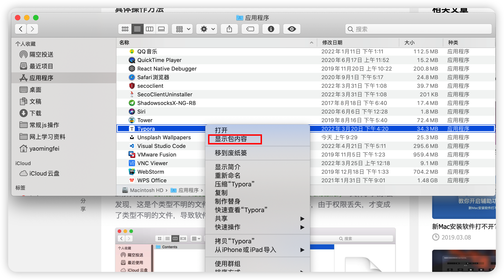
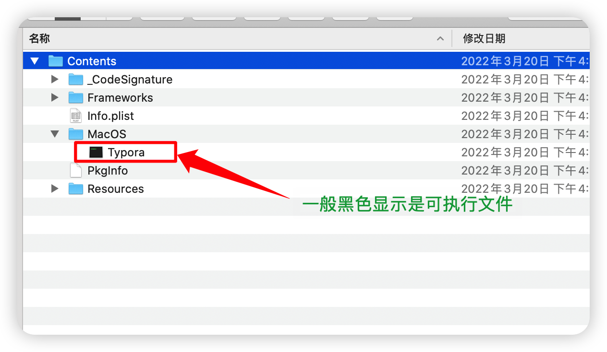
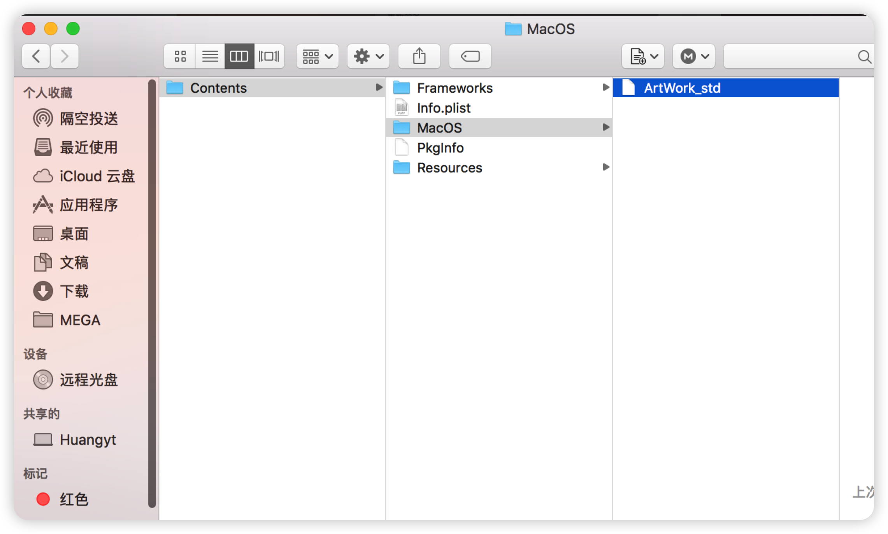
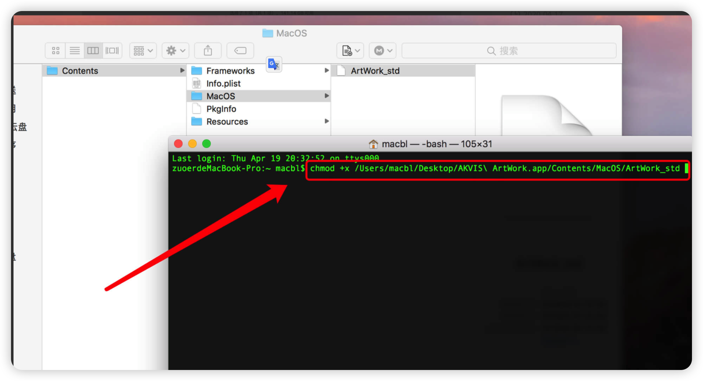
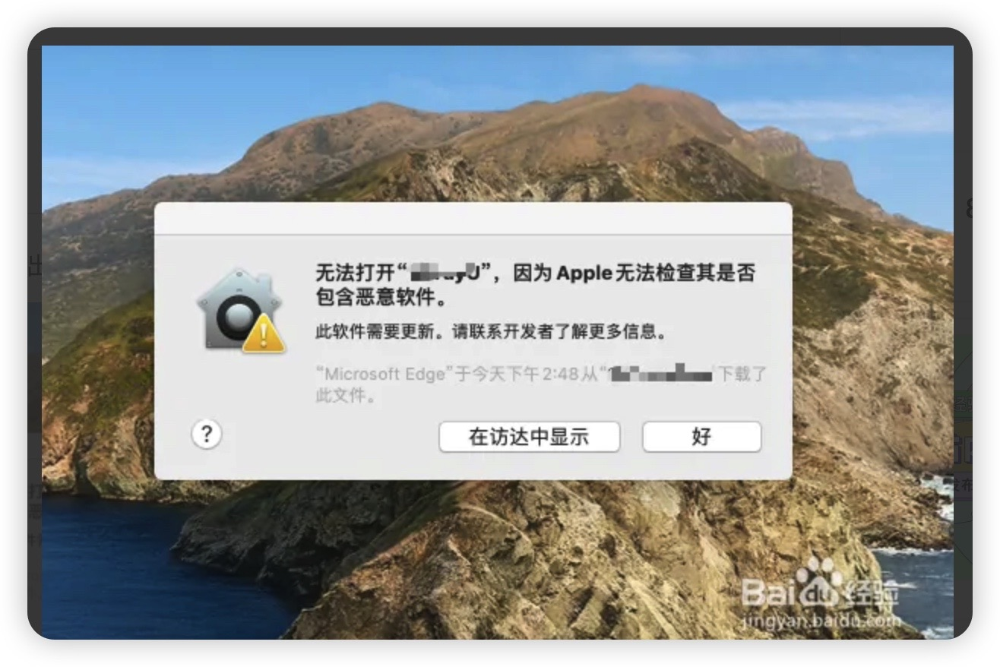
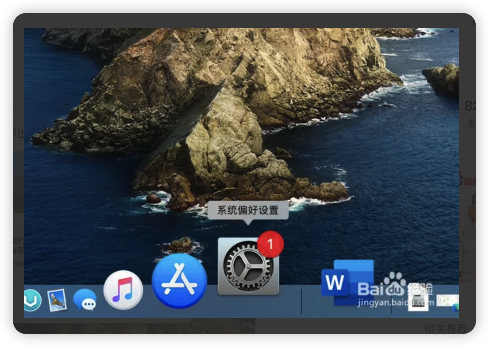
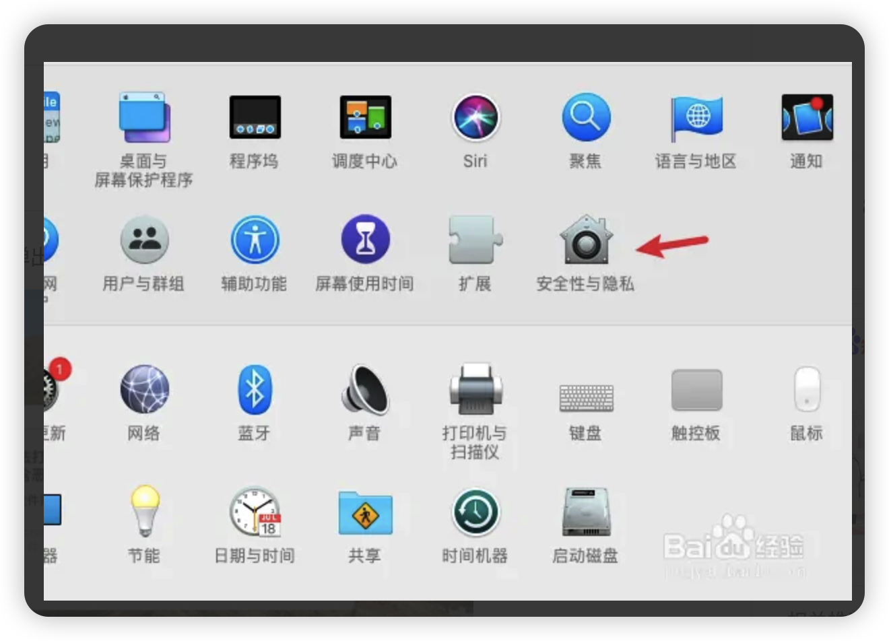
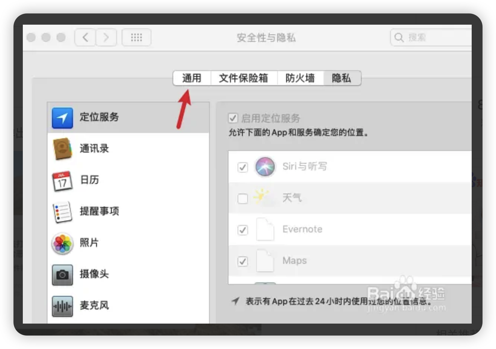
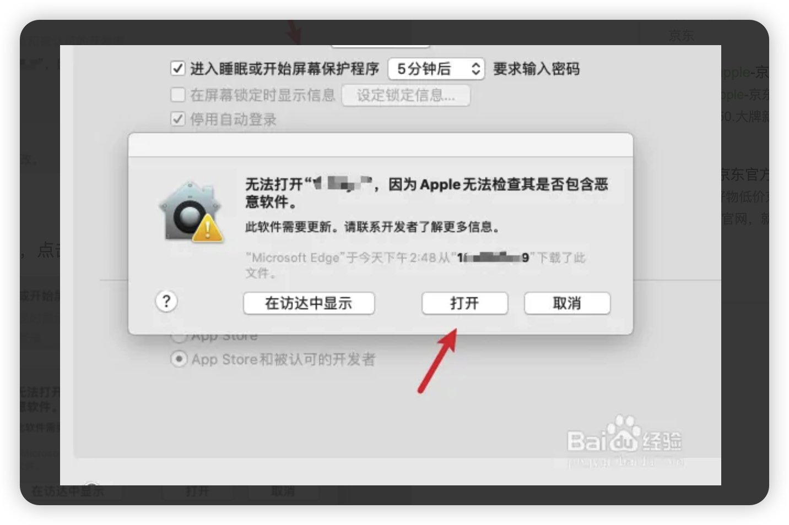

1. ## [应用程序不能打开？一条命令就搞定！](https://www.macbl.com/article/tips/1463)
***

> 打开终端，输入“chmod +x”，注意“chmod”和“+x”中间有个空格，然后再次空格，将“ArtWork_std（或Plugin Installer）”文件拖入终端，接着回车。

2. ## 第二种情况 无法打开因为apple无法检查其是否包含恶意软件
***

