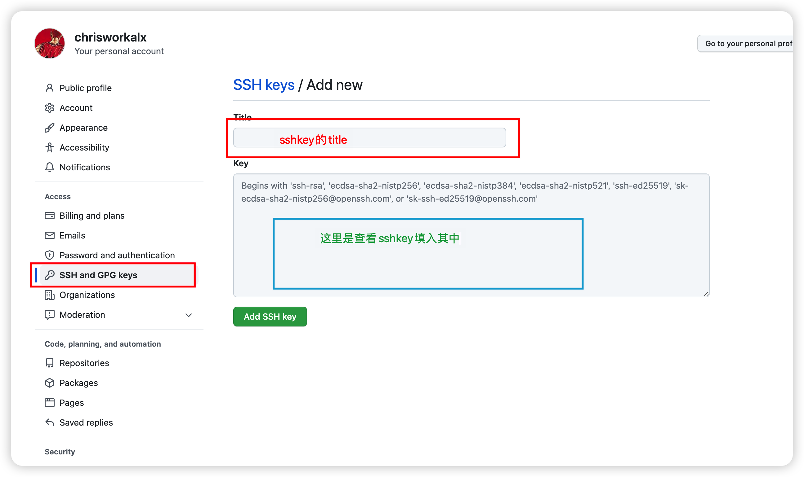

# 多个ssh构建教程
1. 打开您的Git bash，进入 ~/.ssh 目录，通过 ll 命令看看自个儿的电脑上有 SSH-Key 的相关文件没！
```
cd ~/.ssh
```
> 如果显示 id_rsa 和 id_rsa.pub 文件，说明已经有SSH Key了。如果没有，那么根据步骤2生成一个！
2. 生成一个（或多个）SSH-Key
>如生成一个 Github 用的 SSH-Key，其中 github_id_rsa 为密钥的文件名，~/.ssh/github_id_rsa 为密钥目录位置：
```
ssh-keygen -t rsa -C '[邮箱]' -f ~/.ssh/github_id_rsa
```

3. 生成一个 Gitlab 用的 SSH-Key，其中 gitlab_id_rsa 为密钥的文件名，~/.ssh/gitlab_id_rsa 为密钥目录位置：
```
ssh-keygen -t rsa -C '[邮箱]' -f ~/.ssh/gitlab_id_rsa
```
4. 新建config并配置
>在 ~/.ssh 目录下，通过 touch 命令新建 config 文件，并用 vim 编辑器打开 config 文件。
```
# 新建 config 文件
$ touch config
# 用 vim 编辑器打开 config 文件
$ vim config
```
>在 config 文件 中，添加如下内容：
```
# github
Host github.com
HostName github.com
PreferredAuthentications publickey
IdentityFile ~/.ssh/github_id_rsa

# gitlab
Host gitlab.com
HostName gitlab.com
PreferredAuthentications publickey
IdentityFile ~/.ssh/gitlab_id_rsa

# 如果生成多个 SSH-Key , 则按上面的格式继续往下写
```
>注意 其中 Host 和 HostName 填写 Git 服务器的域名，IdentityFile 指定私钥的路径（在第二步生成 SSH-Key 时，我们已经指定该路径，拷贝过来即可）。
5. 获取 SSH Key
>前往 ~/.ssh/ 目录下查看生成的文件：

>生成的文件以 [xxx]_rsa 开头, [xxx]_rsa 是私钥, [xxx]_rsa.pub 是公钥。

>通过 cat 命令查看公钥文件里的内容，拷贝内容放到 Github 上就可以正常使用了
```
cat [xxx]_rsa.pub
```

6. 用 ssh 命令测试是否成功配置 SSH Key（若有多个则分别进行测试）
```
$ ssh -T git@github.com
```
7. 小技巧
```
我的项目之前是通过 HTTPS 的方式克隆的，现在想改用 SSH 的方式提交该怎么做呢？
在项目的 .git 文件夹里，找到 config 文件并打开，修改里面的url。
```


8. ssh-keygen 常用参数说明：
```
-t : 密钥类型, 可以选择 dsa | ecdsa | ed25519 | rsa ;
-f : 密钥目录位置, 默认为当前用户home路径下的 .ssh 隐藏目录, 也就是 ~/.ssh/ , 同时默认密钥文件名以 id_rsa 开头. 如果是 root 用户, 则在 /root/.ssh/id_rsa , 若为其他用户, 则在/home/username/.ssh/id_rsa;
-C : 指定此密钥的备注信息, 需要配置多个免密登录时, 建议携带;
```